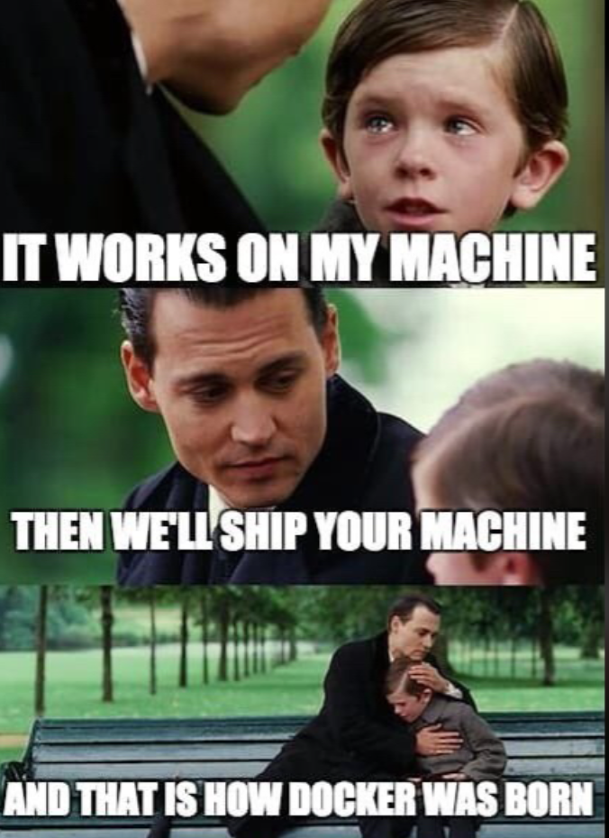

# Dockerizing Go API and Caddy

Hello! In this post I'll walk through how to use Caddy as a reverse proxy and Docker for containerization to deploy a simple Go API. This method offers a quick and modern to getting your Go API up and running.

Before we dive into the deployment steps, let's briefly discuss why Docker and Caddy are an excellent combination.

- **Docker** is a containerization platform that packages your app and all its dependecies into an isolated unit. This guarantess that your app runs consistenly everywhere, eliminating the classic *"it works on my machine"* problem.

<div style="text-align:center">
  
</div>

- **Dockerile** is the blueprint that defines how your Docker image is built. It specifies the base image, the steps to compile your application, and how the container should run.
- **Docker Compose** is a tool for defining and running multi-container Docker applications. Instead of starting each container manually, we can describe the entire stack in a single YAML file.
- **Caddy**  is a modern reverse proxy and web server built using Go. Caddy is renowned for its ease of use, especially its **automatic HTTPS** feature. Its simple configuration makes it an ideal choice for serving our API.

## Requirements

Before we start, you'll need to install Go, Docker and Docker Compose on your system.

1. Go

Make sure Go is installed. You can check your version with:

```go
$ go version

go version go1.24.0 linux/amd6
```

If it's not installed, you can download it from [the official site](https://go.dev/dl).

2. Docker & Docker Compose

Make sure Docker & Docker Compose are installed. You can check your docker version with:

```bash
$ docker --version

Docker version 27.5.1, build 9f9e405
```

```bash
$ docker compose version

Docker Compose version v2.3.3
```

Follow the official guides to install Docker and Docker Compose for your operating system if you haven't installed them before. [The official site](https://docs.docker.com/engine/install).

### Step 1: Create and Run a Simple Go API

- First, create a new directory for the project and initialize a Go module:

```bash
$ mkdir go-api && cd go-api
```

```go
$ go mod init example.com/go-api
```

> This command creates a Go module (go.mod) named example.com/go-api, which helps manage dependencies and makes the project reproducible.

- Next, create a new file `main.go` and define a simple HTTP server using Chi as the router.

The server exposes two routes:

1. Root path `/` -> return an ASCII banner generated with the `go-figure` package.

```go
func handler(w http.ResponseWriter, r *http.Request) {
	w.Header().Set("Content-Type", "text/plain")
	asciiArt := figure.NewFigure("Go API - Caddy", "", true).String()
	fmt.Fprintln(w, asciiArt)
}
```

2. `/api/hello` -> returns a simple JSON response.

```go
func apiHandler(w http.ResponseWriter, r *http.Request) {
	w.Header().Set("Content-Type", "application/json")
	fmt.Fprintf(w, `{"message":"Hello, World!"}`)
}
```

3. In the main function, we:

    - Initialize the Chi router and register both routes.

    - Configure an HTTP server to listen on port 8081.

    - Run the server in a goroutine and listen for shutdown signals (SIGINT, SIGTERM).

    - Gracefully shut down the server with a 5-second timeout when a termination signal is received.

```go
func main() {

	r := chi.NewRouter()

	// API Route
	r.Get("/", handler)
	r.Get("/api/hello", apiHandler)

	srv := &http.Server{
		Addr:    ":8081",
		Handler: r,
	}

	stop := make(chan os.Signal, 1)
	signal.Notify(stop, syscall.SIGINT, syscall.SIGTERM)

	go func() {
		fmt.Println("Server started at :8081")
		if err := srv.ListenAndServe(); err != nil && err != http.ErrServerClosed {
			fmt.Printf("Could not listen on port 8081: %v\n", err)
		}
	}()

	<-stop

	fmt.Println("Shutting down server...")

	ctx, cancel := context.WithTimeout(context.Background(), 5*time.Second)
	defer cancel()

	if err := srv.Shutdown(ctx); err != nil {
		fmt.Printf("Server shutdown failed: %v\n", err)
	}
}
```

Here the full code:

```go
package main

import (
	"context"
	"fmt"
	"net/http"
	"os"
	"os/signal"
	"syscall"
	"time"

	"github.com/common-nighthawk/go-figure"
	"github.com/go-chi/chi/v5"
)

func handler(w http.ResponseWriter, r *http.Request) {
	w.Header().Set("Content-Type", "text/plain")
	asciiArt := figure.NewFigure("Go API - Caddy", "", true).String()
	fmt.Fprintln(w, asciiArt)
}

func apiHandler(w http.ResponseWriter, r *http.Request) {
	w.Header().Set("Content-Type", "application/json")
	fmt.Fprintf(w, `{"message":"Hello, World!"}`)
}

func main() {

	r := chi.NewRouter()

	// API Route
	r.Get("/", handler)
	r.Get("/api/hello", apiHandler)

	srv := &http.Server{
		Addr:    ":8081",
		Handler: r,
	}

	stop := make(chan os.Signal, 1)
	signal.Notify(stop, syscall.SIGINT, syscall.SIGTERM)

	go func() {
		fmt.Println("Server started at :8081")
		if err := srv.ListenAndServe(); err != nil && err != http.ErrServerClosed {
			fmt.Printf("Could not listen on port 8081: %v\n", err)
		}
	}()

	<-stop

	fmt.Println("Shutting down server...")

	ctx, cancel := context.WithTimeout(context.Background(), 5*time.Second)
	defer cancel()

	if err := srv.Shutdown(ctx); err != nil {
		fmt.Printf("Server shutdown failed: %v\n", err)
	}
}
```

Then, try run the main.go using `go run`:

```go
$ go run main.go
```

After that, you should see this message in the terminal:

```
Server started at :8081
```

Finally, you can test the API using `curl` or access from the browser on `http://127.0.0.1:8081`:

```bash
$ curl 127.0.0.1:8081

   ____                _      ____    ___                ____               _       _
  / ___|   ___        / \    |  _ \  |_ _|              / ___|   __ _    __| |   __| |  _   _
 | |  _   / _ \      / _ \   | |_) |  | |     _____    | |      / _` |  / _` |  / _` | | | | |
 | |_| | | (_) |    / ___ \  |  __/   | |    |_____|   | |___  | (_| | | (_| | | (_| | | |_| |
  \____|  \___/    /_/   \_\ |_|     |___|              \____|  \__,_|  \__,_|  \__,_|  \__, |
                                                                                        |___/
```

```bash
$ curl 127.0.0.1:8081/api/hello

{"message":"Hello, World!"}
```

### Step 2: The Dockerfile

We'll use a multi-stage build to create a minimal and secure Docker image. This process compiles our Go application in one stage and then copies only the final binary to a much smaller final image. This keeps our final image size low and reduces the attack surface.

Create a `Dockerfile` in your project directory and add the following code:

```dockerfile
# First stage: builder
FROM golang:1.24 AS builder

WORKDIR /go/src/app

COPY . .

RUN go mod download

RUN CGO_ENABLED=0 go build -o /go/bin/app
```

- In the builder stage, we use the official Go image (golang:1.24) to compile our code.
- We copy the entire project into the container and run go mod download to fetch dependencies.
- Then we build the binary with CGO_ENABLED=0 to ensure it’s statically compiled and portable. The binary is placed in /go/bin/app.

```dockerfile
# Second stage: final image
FROM golang:1.24

# Copy only the compiled binary from builder stage
COPY --from=builder /go/bin/app /

EXPOSE 8081

ENV PORT 8081

CMD ["/app"]
```

- In the final stage, we again start from the golang:1.24 base image (but ideally this could be replaced with something smaller like alpine or scratch to further reduce size).
- Only the compiled binary is copied over from the builder stage. This keeps the image small because source code, dependencies, and build tools are excluded.
- We expose port 8081 so Docker knows which port the app listens on.
- `CMD ["/app"]` runs the binary as the container’s main process.

Here the full code:

```dockerfile
FROM golang:1.24 AS builder

WORKDIR /go/src/app

COPY . .

RUN go mod download

RUN CGO_ENABLED=0 go build -o /go/bin/app

FROM golang:1.24

COPY --from=builder /go/bin/app /

EXPOSE 8081

ENV PORT 8081

CMD ["/app"]
```

> 💡 Instead of `golang:1.24` for the final stage, you can switch to something lighter to reduce image size.

### Step 3: Configure Caddy

Caddy will act as a reverse proxy that forwards incoming requests to the Go API container. This allows us to:

- Tells Caddy to listen on port 80 (HTTP).
- Forwards requests to the Go API container, using the Docker service name go-api and port 8081.

Create a file named `Caddyfile` in your project directory:

```sh
:80 {
    reverse_proxy go-api:8081
}
```

> 💡 If you later have a domain (e.g. api.example.com), you can replace :80 with your domain

```sh
api.example.com {
    reverse_proxy go-api:8081
}
```

### Step 4: Configure Docker Compose

References:

- [Docker Documentation](https://docs.docker.com)
- [Docker Compose Documenation](https://docs.docker.com/compose)
- [Caddy Documentation](https://caddyserver.com/docs)
